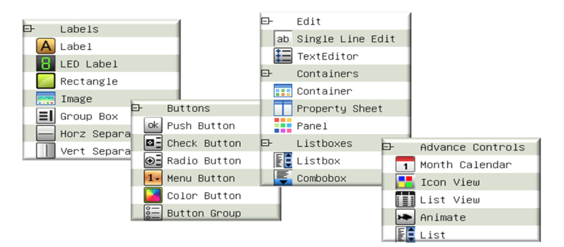
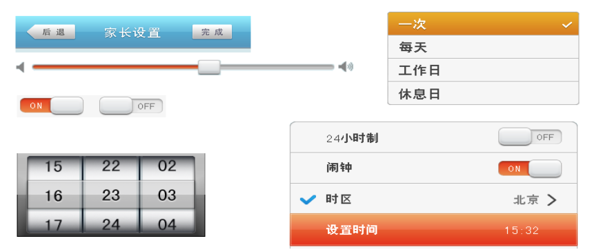
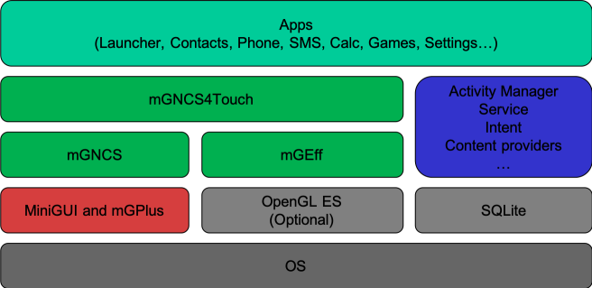
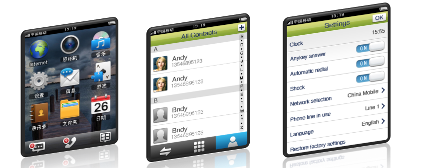
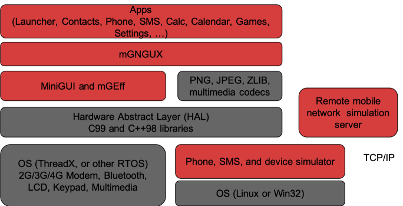
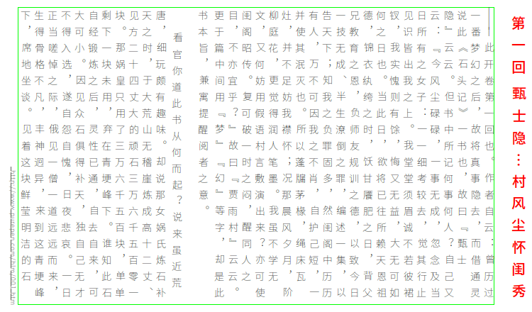
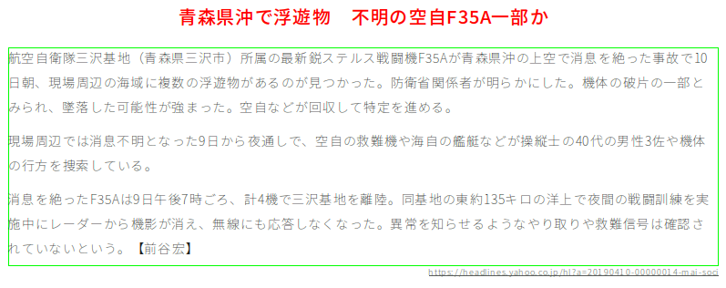
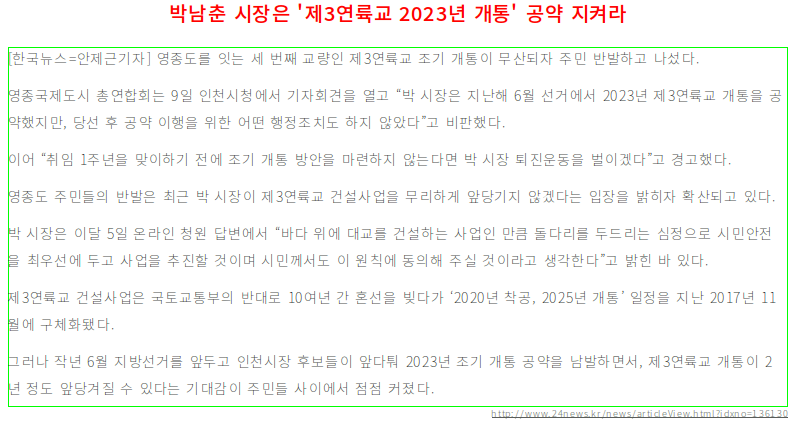
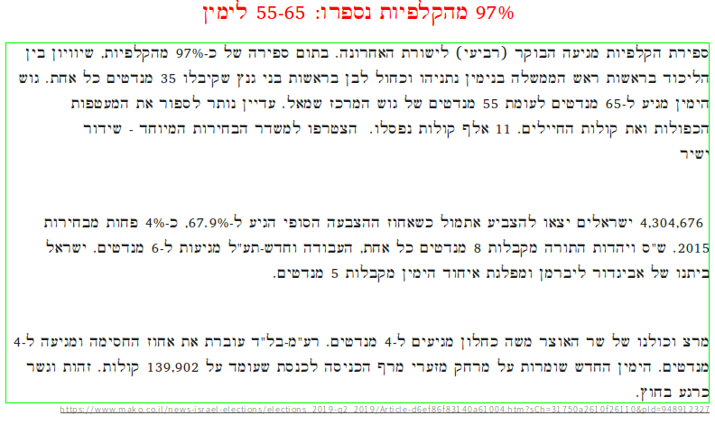
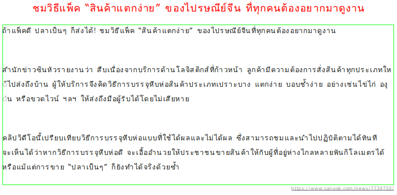

# MiniGUI Overview

_A mature and proven cross-platform windowing system and GUI system
for embedded and/or smart IoT devices._

## TABLE OF CONTENTS

- [INTRODUCTION](#introduction)
- [CHARTS AND SCREENSHOTS](#charts-and-screenshots)
- [A BRIEF BUILDING INSTRUCTION](#a-brief-building-instruction)
  * [Prerequisites](#prerequisites)
  * [Building MiniGUI Core](#building-minigui-core)
  * [Building the Comprehensive Demo](#building-the-comprehensive-demo)
  * [Unit Tests](#unit-tests)
- [NEW FEATURES IN VERSION 4.0.x](#new-features-in-version-40x)
- [NEW FEATURES IN VERSION 3.2.x](#new-features-in-version-32x)
- [ADVANTAGES OF MINIGUI](#advantages-of-minigui)
- [HIGHLIGHTS OF MINIGUI](#highlights-of-minigui)
  * [The Runtime Modes of MiniGUI](#the-runtime-modes-of-minigui)
  * [Support for Multiple Font Types](#support-for-multiple-font-types)
  * [Support for Various Graphics Devices](#support-for-various-graphics-devices)
  * [Support for Various Input Devices](#support-for-various-input-devices)
  * [Common Controls](#common-controls)
  * [Look and Feel Renderers](#look-and-feel-renderers)
  * [Others](#others)
  * [Successful Cases](#successful-cases)
- [HISTORY](#history)
- [AUTHORS AND COPYING](#authors-and-copying)
  * [Not Free for Commercial Use](#not-free-for-commercial-use)
  * [Special Statement](#special-statement)
- [A LITTLE FAQ](#a-little-faq)

## INTRODUCTION

MiniGUI is a mature and proven cross-platform windowing system and a GUI
(Graphics User Interface) support system for embedded systems and smart
IoT devices.

MiniGUI is released under GPLv3 and the dual-licensing applies to commercial
use.

MiniGUI aims to provide a fast, stable, full-featured, and cross-platform
windowing and GUI support system, which is especially fit for
embedded systems or smart IoT devices based-on Linux/uClinux, eCos, and other
traditional RTOSes, such as RT-Thread, RTEMS, FreeRTOS, VxWorks, ThreadX, Nucleus,
pSOS, uC/OS-II, and OSE.

MiniGUI is also a free software project. In December 1998, the initiator of
FMSoft, Wei Yongming, began to develop MiniGUI under the GNU General Public
License (GPL). In September 2002, the core developers of
MiniGUI founded Beijing FMSoft Technologies Co., Ltd., and started the
commercial marketing with the free software. By now, FMSoft still
continues to release MiniGUI as a free software project.

MiniGUI Core provides the basic windowing
and graphics interfaces as well as a lot of standard controls (toolkit).
Besides MiniGUI Core, FMSoft also provides some components
for the developers to develop app much easier:

* [mGUtils]: A MiniGUI component which contains miscellaneous utilities
  like `ColorSelectionDialogBox`, `FileOpenDialogBox`, and so on.
* [mGPlus]: A MiniGUI component which provides support for advanced graphics
  functions like path, gradient, anti-aliased stretch, and color combination.
* [mGEff]: mGEff provides an animation framework for MiniGUI app.
  It also provides some popular UI/UE special effects.
* [mGNCS]: This component provides a new control set for MiniGUI app.
* [mGNCS4Touch]: This component provides some new controls, which are
  compliant to the new control API spec of mGNCS, for devices with
  touch screens.

You can download the source code tarballs of MiniGUI Core, MiniGUI
components, and the dependent libraries from the download zone of
the site:

<http://www.minigui.com/en/download>

FMSoft also releases some open source apps for MiniGUI on the site above,
for examples:

* mDolphin, licensed under Apache 2.0, is a full-featured
  WEB/WAP browser, which is developed based on the open source browser
  core WebKit and uses MiniGUI as its underlying graphics support system.
* mGallery, licensed under Apache 2.0, intends to
  provide a total solution for PMP (Portable Multimedia Player),
  which uses MiniGUI as the graphics platform.
* mSpider, licensed under GPL 3.0, intends to provide a
  light-weight MiniGUI-based web browser (HTML 3.2 and part JavaScript)
* mEagle, licensed under GPL 3.0, is an embedded GIS development platform
  which addresses the needs of map browse, query, analysis, etc

FMSoft had created the public repositories for MiniGUI core, MiniGUI
components, and other open source apps on GitHub. You can visit them on:

<https://github.com/VincentWei>

and

<https://github.com/FMSoftCN>

We now maintain the documents about MiniGUI on the following public repo:

<https://github.com/VincentWei/minigui-docs>

## CHARTS AND SCREENSHOTS

__NOTE__ If you can not see the figures below, please visit the
original page: <https://gitlab.fmsoft.cn/VincentWei/minigui-docs/blob/master/MiniGUI-Overview.md>.

__Figure 1__ The software stack of MiniGUI, MiniGUI components, and MiniGUI apps.

__Figure 2__ The architecture of MiniGUI.

__Figure 3__ The controls provides by mGNCS.

__Figure 4__ The controls provides by mGNCS4Touch.

__Figure 5__ The architecture of [mGUXDemo].

__Figure 6__ Screenshots of [mGUXDemo].

__Figure 7__ MiniGUI-based solution for feature phone.

The solution is developed for feature phones made by Nokia and Samsung.
This solution is not an open source project. If you are interested in this solution, please write
to <sales@minigui.com>.

__Figure 8__ The screenshots of MiniGUI-based solution for feature phone.
Note that the above screenshots conform to the specification of Nokia 3310.
This solution is not an open source project. If you are interested in this solution, please write
to <sales@minigui.com>.

__Figure 9__ Samples of complex scripts: Vertical layout of Chinese, Japanese, and Korean.

__Figure 10__ Samples of complex scripts: Arabic, Hebrew, and Thai.

## A BRIEF BUILDING INSTRUCTION

This instruction assumes that you are using Ubuntu Linux.

### Prerequisites

You should run `apt install <package_name>` to install the following packages
on your Ubuntu Linux.

* Building tools:
   * autoconf
* Dependent libraries (all are optional):
   * libjpeg64-dev
   * libpng12-dev (use libpng-dev on Ubuntu Linux 18.04 LTS)
   * libfreetype6-dev

### Building MiniGUI Core

MiniGUI core uses GNU autoconf/automake scripts to configure and build the project.

Run

    $ ./configure; make; sudo make install

to configure, make, and install the headers and the libraries. If there is not
`configure` file, please run

    $ ./autogen.sh

to generate the script.

MiniGUI core also provides some configuration options to customize the features.
For more information, please run

    $ ./configure --help

### Building the Comprehensive Demo

If you are anxious to see the comprehensive demo of MiniGUI core
and MiniGUI components, please fetch one of the following repositories
from GitHub and follow the instructions to build the samples and
the demonstration programs:

https://github.com/VincentWei/build-minigui-4.0

or

https://github.com/VincentWei/build-minigui-3.2

### Unit Tests

Since MiniGUI 4.0.0, we organize the unit test code of MiniGUI APIs in the
following repository:

https://github.com/VincentWei/mg-tests

If you are interested in hacking the MiniGUI code, please visit this repository.

## NEW FEATURES IN VERSION 4.0.x

In this version, we enhanced and tuned the APIs related to text rendering,
in order to support [HybridOS Foundation Class Library].

* MiniGUI now provides complete APIs for Unicode characters processing.
  These APIs conform to Unicode 12.0.

* MiniGUI also provides new APIs to lay out, shape, and render glyphs
  from complex and mixed scripts, such as Arabic, Thai, and Indic.

* We tuned and optimized MiniGUI's logical and device font interfaces to
  support the new features above.

* MiniGUI now is enhanced to support input events which may be generated
  by input devices other than standard mouse (or single-touch panel) and
  keyboard, such as multi-touch panel (gesture), joystick, tablet tool,
  table pad, and switch. In MiniGUI 4.0, we introduce `MSG_EXIN_XXX` messages
  to support the input events from devices other than standard mouse
  and keyboard. We call these messages as 'extra input messages'.

* The NEWGAL engine of `dri` to support modern DRI/DRM-driven graphics cards
  or GPUs on Linux.

* The IAL engine of `libinput` to support all modern input devices including
  mouse, keyboard, joystick, switch, multiple touch panel, gesture, tablet tool,
  and table pad on Linux.

* We introduced a Slice Memory Allocator for fast concurrent memory chunk
  allocation.

* Cleanup and tune code for GCC 7.3.

For more information, please refer to `RELEASE-NOTES.md` file:

https://github.com/VincentWei/minigui/blob/master/RELEASE-NOTES.md

Because of the changes of some APIs, we recommended strongly that you
use this version for new projects.

## NEW FEATURES IN VERSION 3.2.x

We introduce some new features in MiniGUI Version 3.2.x:

  * The support for 64-bit platform. Note that some APIs have changed
    to support 64-bit platform.
  * Some enhancements and optimizations.

For more information, please refer to `RELEASE-NOTES.md` file:

https://github.com/VincentWei/minigui/blob/rel-3-2/RELEASE-NOTES.md

## ADVANTAGES OF MINIGUI

* Support for multiple operating systems:
  * Linux
  * VxWorks, ThreadX, eCos, uC/OS-II, Nucleus, OSE, …
* Excellent portability and great scalability:
  * Monochrome to true-color display.
  * With or without hardware acceleration.
  * Keypad and/or touch panel.
  * Local charset or Unicode.
* Best balance between performance and functionality.
* Flexible configurability.
* A large number of successful cases:
  * Tens of millions of shipments of feature phones.
  * Millions of shipments of digital photo frames.
  * Millions of shipments of industry devices.
* Minimal footprint:
  * 100MHz CPU
  * Runtime RAM consumption: 1MB
  * Static/shared library: 500KB ~ 900KB

## HIGHLIGHTS OF MINIGUI

### The Runtime Modes of MiniGUI

You can configure and compile MiniGUI as one of three runtime modes:

* `MiniGUI-Threads`: A program running on MiniGUI-Threads can create
  multiple cascaded windows in different threads, and all the windows
  belong to a single process. MiniGUI-Threads is fit for some real-time
  systems on Linux/uClinux, eCos, uC/OS-II, VxWorks, pSOS, ThreadX,
  and OSE.

* `MiniGUI-Processes`: A program running on MiniGUI-Processes is
  an independent process, which can also create multiple windows.
  MiniGUI-Processes is fit for some complex embedded systems, such as
  PDAs, Thin-Clients or STBs. This mode is only useful for full-featured
  UNIX-like operating systems, like Linux.

* `MiniGUI-Standalone`: A single process version of MiniGUI. This mode
  is useful for some small systems, like uClinux or RTOSes.

The original MiniGUI (version 1.0) run in MiniGUI-Threads mode.
It is based on POSIX-compliant thread library. And this thread-based
architecture of MiniGUI is very fit for most traditional embedded
operating systems, such as eCos, uC/OS-II, and VxWorks. However,
if you use embedded Linux, the architecture like X Window will have
better stability and scalability, because of the independent memory
address space of every process.

Since version 2.0, we provides a new runtime mode called MiniGUI-Processes.
You can use MiniGUI-Processes to run more than one MiniGUI-based
program in the form of UNIX process at the same time. MiniGUI-Processes
is a full-featured multi-process version of original MiniGUI -- You
can run a program based on MiniGUI-Processes from a program called
'mginit'. Just like X Window, the former process is called a client,
and the latter the server.

Clients connect to the server via UNIX domain socket, and the server
receives and responses requests from clients. The server provides shared
resources for clients, manage window objects, and sends mouse
(or touch screen) and keyboard events to the active top-most client.
If a client exits or dies for some reasons, it will not damage other
clients and the server.

### Support for Multiple Charsets

* ISO8859-1 ~ ISO8859-15
* GB2312, BIG5, EUCKR, SHIFT-JIS
* UNICODE 12.0

### Support for Multiple Font Types

* MiniGUI defined font types: RBF and VBF.
* MiniGUI defined Unicode Pre-rendered fonts (UPF).
* TrueType/OpenType fonts (via FreeType).
* User-defined BITMAP fonts.

### Support for Various Graphics Devices

* All types of display mode
* All types of LCD controller
* YUV output device like TV set

### Support for Various Input Devices

* Keyboard/keypad
* Mouse, single-touch or multi-touch panel
* Joystick
* Remote controller

### Common Controls

* Label
* Button
* Uingle-line and multi-line edit boxes
* List box
* Combo box
* Progress bar
* Property sheet
* Toolbar
* Track bar
* Tree view
* List view
* Month calendar
* Grid view
* Icon view
* Animation
* ...

### Look and Feel Renderers

* To customize the appearance of MiniGUI windows and controls.
* Four built-in LF renderers
   * Classic: Windows style appearance.
   * Fashion: macOS style appearance.
   * Flat: use for gray screen.
   * Skin: render MiniGUI windows/controls by user defined pictures.
* Developer can develop his/her own LF renderer
* The metrics, color, font, and icon of window elements can be customized.

### Others

* Use universal virtual frame buffer to develop MiniGUI apps
  on desktop computer.
* Support for common GUI elements, including menu,
  acceleration key, caret, timer, etc.
* Support for multiple keyboard layouts.
* Support for built-in resources. Thus, MiniGUI can be used
  on some embedded systems without file systems.
* Special support for embedded systems, including the
  common I/O operations, byte-orders related functions,
  touch screen calibration interface, and so on.

### Successful Cases

* Huawei
   * Digital Photo Frames
* Leadcore, ZTE, Hisense
   * 3G feature phone solution (Arena)
* RDA, ASR
   * 3G/4G feature phone solution
* Allwinner, Rockchip
   * Smart IoT devices
* Industry Leaders
   * ABB, Bosch, Mindray, HIKVISION, Nanrui

## HISTORY

21 years have pasted since MiniGUI was initially created at
the end of 1998, and now it becomes much reliable and stable.
During the past years, many remarkable changes have taken place in
the MiniGUI project.

At the original, the version 0.2.xx was based on SVGALib and PThread
(LinuxThreads). Then the version 0.3.xx had many enhanced features
including Graphics Abstract Layer (GAL), Input Abstract Layer (IAL),
and the support for multiple charsets and multiple fonts.

In version 1.0.00, we designed MiniGUI-Lite, which was more fit for
some complex embedded systems, such as PDAs, Thin-Clients, or STBs.
MiniGUI-Lite made the embedded systems more stable and efficient.
The version 1.0.00 provided the native fbcon engine based on Linux
frame buffer device directly as well.

In the development of version 1.1.00, we re-wrote the GAL and GDI
interfaces, and provided some advanced video features, such as raster
operation, transparent blitting, alpha blending, and video hardware
acceleration. We also provided some important GDI functions, such as
Ellipse, Arc, Polygon, and FloodFill.

In the development of version 1.6.0, we added advanced 2D graphics
functions to MiniGUI. It provides the abstract logical pen and brush
objects, and can be used to render advanced graphics objects.

In the development of version 2.0.x, we developed MiniGUI-Processes.

In the development of version 3.0.x, we introduced Look & Feel Renderer,
BIDI text support, Non-rectangular window, double-buffer window, and
other main features.

In the development of version 3.2.x, we introduced the support for
64-bit architectures.

In the development of version 4.0.x, we introduced the support for
complex writing systems (scripts), such as Arabic, Thai, and Indic.

A brief history description of the development progress lay below:

1. Jul., 2019:  
   FMSoft released MiniGUI version 4.0.0.
1. Apr., 2019:  
   FMSoft released MiniGUI version 3.2.2.
1. Feb., 2018:  
   FMSoft released MiniGUI version 3.2.0.
1. Dec., 2017:  
   FMSoft updated MiniGUI and miniStudio for latest Linux distributions.
1. Aug., 2017:  
   FMSoft released the latest source code of mDolphin under Apache 2.0.
1. Aug., 2017:  
   FMSoft released the latest source code of MiniGUI under GPL 3.0.
1. Oct., 2010:  
   MiniGUI official version 3.0.12 released.
1. Aug., 2010:  
   MiniGUI official version 3.0.10 released.
1. May, 2010:  
   MiniGUI official version 3.0.8 released.
1. Jan., 2010:  
   MiniGUI official version 3.0.6 released.
1. Oct., 2009:  
   MiniGUI official version 3.0.4 released.
1. Apr., 2009:  
   MiniGUI official version 3.0.2 released.
1. Nov., 2007:  
   MiniGUI official version 2.0.4/1.6.10 released.
1. Jul., 2006:  
   MiniGUI official version 2.0.3/1.6.9 released.
1. Jun., 2006:  
   MiniGUI provides support for OSE.
1. Oct., 2005:  
   MiniGUI official version 2.0.2 released.
1. Sep., 2005:  
   MiniGUI official version 1.6.8 released.
1. Aug., 2005:  
   MiniGUI beta version 2.0.0 released.
1. Feb., 2005:  
   MiniGUI official version 1.6.1 released.
1. Jan., 2005:  
   MiniGUI tested on ThreadX and pSOS.
1. Jun., 2004:  
   MiniGUI tested on VxWorks.
1. Feb., 2004:  
   MiniGUI tested on eCos and uC/OS-II.
1. Jan., 2004:  
   MiniGUI official version 1.5.1 released (2004/01/18).
1. Sep., 2003:  
   MiniGUI official version 1.3.1 released (2003/09/11).
1. May, 2003:  
   MiniGUI official version 1.2.6 released (2003/05/18).
1. Mar., 2003:  
   MiniGUI official version 1.2.5 released (2003/03/23).
1. Sep., 2002:  
   The main developers of MiniGUI founded a new software corporation:
   Beijing FMSoft Technology Co., Ltd..  And the development and maintenance of MiniGUI
   changes from loosely-knit team to business organization.
1. Apr., 2002:  
   MiniGUI the new stable version 1.2.0 released (2002/04/11).
1. Mar., 2002:  
   MiniGUI API Reference documentation version 1.0 released.
1. Mar., 2002:  
   MiniGUI official version 1.1.0 released (2002/03/08).
   MiniGUI API Reference documentation version 0.9 released.
1. Oct., 2001:  
   MiniGUI version 1.1.0Pre4 released (2001/10/22).
   This version have new GAL and GDI interfaces.
1. Sep., 2001:  
   MiniGUI version 1.0.9 released (2001/09/17),
   this will be the last version of source branch 1.0.x.
1. Sep., 2001:  
   MiniGUI version 1.1.0Pre1 released (2001/09/12).
1. Apr., 2001:  
   MiniGUI version 1.0.00 released (2001/04/16).
1. Feb., 2001:  
   MiniGUI version 1.0.00Pre1 released.
1. Jan., 2001:  
   MiniGUI version 1.0.00Beta1 released.
1. Jan., 2001:  
   MiniGUI version 0.9.98 released. You can build MiniGUI-Lite from this version.
1. Nov., 2000:  
   MiniGUI version 0.9.96 released.
1. Oct., 2000:  
   MiniGUI version 0.9.00 released.
1. Sep., 2000:  
   MiniGUI version 0.3.06 released.
1. Jun., 2000:  
   Began to develop version 1.0.xx.
1. Mar., 2000:  
   Linux distribution installer based-on MiniGUI for HappyLinux 1.0.
1. Jan., 2000:  
   VCOnGUI (Virtual Console on MiniGUI) version 0.2.02.
1. Sep., 1999:  
   Snapshot of screen or window.
1. Sep., 1999:  
   Dialog boxes and message boxes.
1. Aug., 1999:  
   Some standard controls (Portion by Zhao Jianghua).
1. Jul., 1999:  
   GIF and JPG loading support (by LI Zhuo).
1. Jun., 1999:  
   Chinese input method (by Kang Xiaoning).
1. May, 1999:  
   Timer, menu, and the skeleton of control sub-system.
1. Apr., 1999:  
   The skeleton of MiniGUI, windowing sub-system and basic graphics device interfaces.
1. Dec., 1998:  
   Began to write.
1. 1994 ~ 1996:  
   MiniGUI DOS version.

## AUTHORS AND COPYING

The original author of MiniGUI is WEI Yongming, and now MiniGUI is
maintained by FMSoft. For more information, please refer to
<http://www.fmsoft.cn>.

Copyright (C) 2002 ~ 2019, Beijing FMSoft Technologies Co., Ltd.  
Copyright (C) 1998 ~ 2002, WEI Yongming

This program is free software: you can redistribute it and/or modify
it under the terms of the GNU General Public License as published by
the Free Software Foundation, either version 3 of the License, or
(at your option) any later version.

This program is distributed in the hope that it will be useful,
but WITHOUT ANY WARRANTY; without even the implied warranty of
MERCHANTABILITY or FITNESS FOR A PARTICULAR PURPOSE.  See the
GNU General Public License for more details.

You should have received a copy of the GNU General Public License
along with this program.  If not, see <http://www.gnu.org/licenses/>.

Or,

As this program is a library, any link to this program must follow
GNU General Public License version 3 (GPLv3). If you cannot accept
GPLv3, you need to be licensed from FMSoft.

If you have got a commercial license of this program, please use it
under the terms and conditions of the commercial license.

For more information about the commercial license, please refer to
<http://www.minigui.com/en/about/licensing-policy/>.

### Special Statement

The above open source or free software license does
not apply to any entity in the Exception List published by
Beijing FMSoft Technologies Co., Ltd.

If you are or the entity you represent is listed in the Exception List,
the above open source or free software license does not apply to you
or the entity you represent. Regardless of the purpose, you should not
use the software in any way whatsoever, including but not limited to
downloading, viewing, copying, distributing, compiling, and running.
If you have already downloaded it, you MUST destroy all of its copies.

The Exception List is published by FMSoft and may be updated
from time to time. For more information, please see
<https://www.fmsoft.cn/exception-list>.

### Not Free for Commercial Use

As stated above, MiniGUI and its components are licensed under GPL.
So any links about MiniGUI must follow GPL. If you cannot accept GPL,
you need to be licensed from FMSoft.

We provide you the commercial license of MiniGUI according to the number
of the run-time binary copies of MiniGUI. If you are interested in
the commercial license of MiniGUI, please write to <sales@minigui.com>.

## A LITTLE FAQ

Q: Which operating systems does MiniGUI support?  
A: MiniGUI can run on Linux/uClinux, uC/OS-II, eCos, ThreadX, RTEMS,
   RT-Thread, FreeRTOS, pSOS, VxWorks, ThreadX, OSE, and even Win32.
   Any other real-time OSes can be supported theoretically.

Q: Which architecture does MiniGUI support?  
A: x86 32/64-bit, ARM 32/64-bit (e.g., ARMv7 and ARM Cortex-A7),
   PowerPC, MIPS, DragonBall, ColdFire, Blackfin, and so on.

Q: Does MiniGUI offer the support for grey LCD with 4bpp (bits per pixel)?  
A: Yes, it offers. It even offers the support for 1bpp and 2bpp LCD.

Q: Can I get the tech support from MiniGUI team?  
A: Yes, FMSoft can provide you with guaranteed commercial technical
   support services. Please send messages to <sales@minigui.com>.

[mGUtils]: https://github.com/VincentWei/mgutils
[mGEff]: https://github.com/VincentWei/mgeff
[mGPlus]: https://github.com/VincentWei/mgplus
[mGNCS]: https://github.com/VincentWei/mgncs
[mGNCS4Touch]: https://github.com/VincentWei/mgncs4touch
[mGUXDemo]: https://github.com/VincentWei/cell-phone-ux-demo

[Quick Start]: /user-manual/MiniGUIUserManualQuickStart.md
[Building MiniGUI]: /user-manual/MiniGUIUserManualBuildingMiniGUI.md
[Compile-time Configuration]: /user-manual/MiniGUIUserManualCompiletimeConfiguration.md
[Runtime Configuration]: /user-manual/MiniGUIUserManualRuntimeConfiguration.md
[Tools]: /user-manual/MiniGUIUserManualTools.md
[Feature List]: /user-manual/MiniGUIUserManualFeatureList.md
[FAQs]: /user-manual/MiniGUIUserManualFAQsEN.md
[常见问题]: /user-manual/MiniGUIUserManualFAQsZH.md

[Release Notes for MiniGUI 3.2]: /supplementary-docs/Release-Notes-for-MiniGUI-3.2.md
[Release Notes for MiniGUI 4.0]: /supplementary-docs/Release-Notes-for-MiniGUI-4.0.md
[Showing Text in Complex or Mixed Scripts]: /supplementary-docs/Showing-Text-in-Complex-or-Mixed-Scripts.md
[Supporting and Using Extra Input Messages]: /supplementary-docs/Supporting-and-Using-Extra-Input-Messages.md
[Using CommLCD NEWGAL Engine and Comm IAL Engine]: /supplementary-docs/Using-CommLCD-NEWGAL-Engine-and-Comm-IAL-Engine.md
[Using Enhanced Font Interfaces]: /supplementary-docs/Using-Enhanced-Font-Interfaces.md
[Using Images and Fonts on System without File System]: /supplementary-docs/Using-Images-and-Fonts-on-System-without-File-System.md
[Using SyncUpdateDC to Reduce Screen Flicker]: /supplementary-docs/Using-SyncUpdateDC-to-Reduce-Screen-Flicker.md
[Writing DRI Engine Driver for Your GPU]: /supplementary-docs/Writing-DRI-Engine-Driver-for-Your-GPU.md
[Writing MiniGUI Apps for 64-bit Platforms]: /supplementary-docs/Writing-MiniGUI-Apps-for-64-bit-Platforms.md

[MiniGUI User Manual]: /user-manual/README.md
[MiniGUI Programming Guide]: /programming-guide/README.md
[MiniGUI Porting Guide]: /porting-guide/README.md
[MiniGUI API Reference Manuals]: /api-reference/README.md

[MiniGUI Official Website]: http://www.minigui.com
[Beijing FMSoft Technologies Co., Ltd.]: https://www.fmsoft.cn
[FMSoft Technologies]: https://www.fmsoft.cn
[HarfBuzz]: https://www.freedesktop.org/wiki/Software/HarfBuzz/
