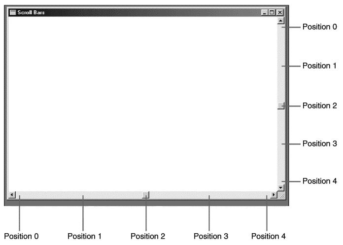
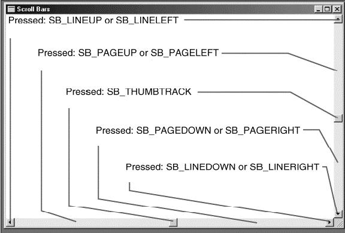
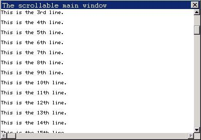

# Scrollbar

## Concept of Scrollbar

__NOTE__ The scrollbar in this chapter is a part of MiniGUI main window and
controls. In MiniGUI 3.0, independent scrollbar control is added, please refer
to [Chapter 39](MiniGUIPGENV301Chapter38) in this guide for details.

Scrollbar is one of the best functions in GUI, which is easy to use and
provides good effect of vision feedback. You can use scrollbar to display any
thing - whatever text, graph, table, database record, image, or web page, if
only the needed space of which exceeds the display region of the window.

Both vertical-direction (for moving up and down) and horizontal-direction (for
moving right and left) scrollbars are available. The user can use mouse to
click on the arrows or in the region between the arrows of the scrollbar, here,
the movement of the thumb in the scrollbar is proportional to the movement of
the displayed information in the whole file. The user can also use mouse to
drag the thumb to a specified position. Figure 1 shows the suggested using
method of the vertical scrollbar.


##### Figure 1 Suggested using method of the vertical scrollbar

Sometimes, the programs fell difficult to understand the scrolling concept,
because their opinion is different from that of the users: the user intends to
see the lower part of the file by scrolling downward; however, the program
actually moves the file upward relative to the display window. MiniGUI is
according to the user’s opinion: scrolling upward means moving to the start of
the file; scrolling downwards means moving to the end of the file.

It is easy to include horizontal or vertical scrollbar in the application. The
program need only to include window style WS_VSCROL and/or WS_HSCROLL in the
third argument of CreateWindow or CreateMainWindow. These scrollbars are
commonly placed in the right side and bottom side of the window, extending to
the whole length or width of the display region. The client area does not
include the space filled by scrollbar. If you want to set scrollbar at the left
side of the window, please use WS_EX_LEFTSCROLLBAR extended style.

In MiniGUI, mouse click is automatically transformed into corresponding
message; however, you must treat the keyboard message by yourself.

## Enabling or Disabling a Scrollbar

```cpp
EnableScrollBar (hWnd, SB_HORZ, TRUE);
EnableScrollBar (hWnd, SB_VERT, FALSE);
```
EnableScrollBar function can be used to enable or disable the scrollbar, and
its second parameter specifies which (vertical or horizontal) scrollbar will be
operated.

## Range and Position of a Scrollbar

Each scrollbar has a related “range” (which is a pair of integer, representing
the minimum and the maximum) and “position” (which is the position of thumb in
the range). When the thumb is positioned at the top (or left) of the scrollbar,
the position of the scroll bar is the minimum of the range; when the thumb is
positioned at the bottom (or right) of the scrollbar, the position of the
scroll bar is the maximum of the range.

In a default case, the range of the scrollbar is from 0 (top or left) to 100
(bottom or right), while we can also change the range to values, which are easy
to treat by a program:

```cpp
SCROLLINFO si;

si.nMax = 100;  // The maximal position
si.nMin = 0;	    // The minimal position
si.nPage = 10;  // this variable determines the length of the thumb
                  // this length is dependent on the value of nPage/(nMax-nMin)
si.nPos = 0;	    // the present position of the thumb, which must be between nMin and nMax

SetScrollInfo (hWnd, Bar, &si, bRedraw);
```

The argument Bar is SB_VERT or SB_HORZ, and nMin and nMax is the minimum and
maximum of the range, respectively. If you want MiniGUI redraw the scrollbar
according to the new range, bRedraw should be set to TRUE (if you recall other
functions which influence the position of the scrollbar after recalling
SetScrollRange, bRedraw should be set to FALSE to prevent the scrollbar from
being redrew excessively). The position of the thumb is always discrete
integer. For example, a scrollbar with range from 0 to 4 has five positions of
thumb, as shown in Figure 2.



##### Figure 2  A scrollbar with range from 0 to 4 has five positions of thumb

When the scrollbar is used in a program, the program together with MiniGUI is
in charge of maintaining the scrollbar and updating the position of the thumb.
Following is the handling of the scrollbar by MiniGUI:

Handling all the scrollbar mouse events.
- When the user drags the thumb in the scrollbar, move the thumb.
- Sending scrollbar message to the window procedure of the window containing
  the scrollbar.  Following are the tasks remained for the program:
- Initializing the range and position of the scrollbar.
- Handling the scrollbar message in the window procedure.
- Refreshing the position of the scroll thumb in the scrollbar.
- Changing the content in the display region responding the change of the
  scrollbar.

## Messages of Scrollbar

When the user clicks the scrollbar or drags the thumb by mouse, MiniGUI sends
message of MSG_VSCROLL (for moving up and down) and MSG_HSCROLL (for moving
left and right) to the window procedure.

Like all other messages, MSG_VSCROLL and MSG_HSCROLL also have message
parameter lParam and wParam. In most cases, we can ignore the parameter lParam.

WParam is a value, which specifies the operation to the scrollbar by the mouse.
The value is regarded as a “Notification code”. The notification code is
defined with a prefix “SB_“. Table 8.1 illustrates the notification codes
defined by MiniGUI.

##### Table 8.1 The scrollbar notification codes defined by MiniGUI

| *Notification code identifier* | *Meaning* |
|--------------------------------|-----------|
| SB_LINEUP        | Click once the up arrow in the vertical scrollbar by mouse. |
| SB_LINEDOWN      | Click once the down arrow in the vertical scrollbar by mouse. |
| SB_LINELEFT      | Click once the left arrow in the horizontal scrollbar by mouse. |
| SB_LINERIGHT     | Click once the right arrow in the horizontal scrollbar by mouse. |
| SB_PAGEUP        | Click once the region between the up arrow and the thumb of the vertical scrollbar by mouse. |
| SB_PAGEDOWN      | Click once the region between the down arrow and the thumb of the vertical scrollbar by mouse. |
| SB_PAGELEFT      | Click once the region between the left arrow and the thumb of the horizontal scrollbar by mouse. |
| SB_PAGERIGHT     | Click once the region between the right arrow and the thumb of the horizontal scrollbar by mouse. |
| SB_THUMBTRACK    | Message received by the window when the user drags the thumb. It should be noted that the value passed through lParam presents the corresponding numerical value. |
| SB_THUMBPOSITION | The user finished dragging the thumb. |

The identifiers including LEFT and RIGHT are used to horizontal scrollbar, and
the identifiers including UP and DOWN is used to vertical scrollbar. The
identifiers generated by the mouse clicking in different regions of the
scrollbar are shown in Figure 3.


##### Figure 3 Identifiers generated by the mouse clicking in different regions of the scrollbar

Program can receive multiple scrollbar messages if you press the mouse button
at many different scrollbar parts.

When you put the mouse cursor on the thumb and press the mouse button, you can
move the thumb. Scrollbar message including notification code of SB_THUMBTRACK
is thus generated. When wParam is SB_THUMBTRACK, lParam is the present position
when the user drags the thumb. This position is between the minimum and the
maximum. As for other scrollbar operations, lParam should be ignored.

For providing feedback to the user, window system moves the thumb when you move
it with mouse, and at the same time your program will receive message of
SB_THUMBTRACK. However, if you do not recall SetScrollPos to handle messages of
SB_THUMBTRACK or SB_THUMBPOSITION, the thumb will jump back to its original
position after the user releases the mouse button.

Program can handle message of SB_THUMBTRACK. If the message of SB_THUMBTRACK is
handled, you need move the content in the display region when the user drags
the thumb.

## Sample Program

List 1 presents a simple scrollbar-handling program. The complete code of this
program is available in scrollbar.c in the sample program package mg-samples.

##### List 1 Scrollbar and its handling

```cpp
#include <stdio.h>
#include <string.h>

#include <minigui/common.h>
#include <minigui/minigui.h>
#include <minigui/gdi.h>
#include <minigui/window.h>

/* define the string array to be displayed in the window */
static char* strLine[] = {
        "This is the 1st line.",
        "This is the 2nd line.",
        "This is the 3rd line.",
        "This is the 4th line.",
        "This is the 5th line.",
        "This is the 6th line.",
        "This is the 7th line.",
        "This is the 8th line.",
        "This is the 9th line.",
        "This is the 10th line.",
        "This is the 11th line.",
        "This is the 12th line.",
        "This is the 13th line.",
        "This is the 14th line.",
        "This is the 15th line.",
        "This is the 16th line.",
        "This is the 17th line."
};

/* The window procedure */
static int ScrollWinProc(HWND hWnd, int message, WPARAM wParam, LPARAM lParam)
{
    static int iStart = 0;
    static int iStartPos = 0; 

    switch (message) {
        case MSG_CREATE:
            /* Create caret */
            if (!CreateCaret (hWnd, NULL, 8, 14))
                fprintf (stderr, "Create caret error!\n");
        break;

        case MSG_SHOWWINDOW:
            /* Disable the horizontal scrollbar */
            EnableScrollBar (hWnd, SB_HORZ, FALSE);
            /* set scrolling range of the vertical scrollbar: 0~20 */
            SetScrollRange (hWnd, SB_VERT, 0, 20);
            ShowCaret (hWnd);
        break;

        case MSG_SETFOCUS:
            /* activeate and display the caret when obtaining input focus */
            ActiveCaret (hWnd);
            ShowCaret (hWnd);
        break;

        case MSG_KILLFOCUS:
            /* hide the caret when losing input focus */
            HideCaret (hWnd);
        break;

        case MSG_LBUTTONDOWN:
            /* modify the position of the caret when mouse clicking */
            SetCaretPos (hWnd, LOWORD (lParam), HIWORD (lParam));
        break;

        case MSG_LBUTTONDBLCLK:
            /* hide the horizontal scrollbar when left mouse button double clicked */
            ShowScrollBar (hWnd, SB_HORZ, FALSE);
        break;

        case MSG_RBUTTONDBLCLK:
            /* show the horizontal scrollbar when right mouse button double clicked */
            ShowScrollBar (hWnd, SB_HORZ, TRUE);
        break;

        /* handle the horizontal scrollbar message */
        case MSG_HSCROLL:
            if (wParam == SB_LINERIGHT) {

                if (iStartPos < 5) {
                    iStartPos ++;
                   /* scrolling to the right, one charater width once */
                    ScrollWindow (hWnd, -GetSysCharWidth (), 0, NULL, NULL);
                }
            }
            else if (wParam == SB_LINELEFT) {
                if (iStartPos > 0) {
                    iStartPos --;

                    /* scrolling to the left, one charater width once */
                    ScrollWindow (hWnd, GetSysCharWidth (), 0, NULL, NULL);
                }
            }
        break;

        /* handle the vertical scrollbar message */
        case MSG_VSCROLL:
            if (wParam == SB_LINEDOWN) {

                if (iStart < 12) {
                    iStart ++;
                    /* scrolling upwards, 20 pixels once  */
                    ScrollWindow (hWnd, 0, -20, NULL, NULL);
                }
            }
            else if (wParam == SB_LINEUP) {
                if (iStart > 0) {
                    iStart --;

                    /* scrolling downwards, 20 pixels once */
                    ScrollWindow (hWnd, 0, 20, NULL, NULL);
                }
            }
            /* refresh the scrollbar position */
            SetScrollPos (hWnd, SB_VERT, iStart);
        break;

        case MSG_PAINT:
        {
            HDC hdc;
            int i;
            RECT rcClient;

            GetClientRect (hWnd, &rcClient);

            hdc = BeginPaint (hWnd);
            /* output 17 strings according to the present scrolling position */
            for (i = 0; i < 17 - iStart; i++) {
                rcClient.left = 0;
                rcClient.right = (strlen (strLine [i + iStart]) - iStartPos)
                                 * GetSysCharWidth ();
                rcClient.top = i*20;
                rcClient.bottom = rcClient.top + 20;

                TextOut (hdc, 0, i*20, strLine [i + iStart] + iStartPos);
            }

            EndPaint (hWnd, hdc);
        }
        return 0;

        /* destroy the caret and the main window */
        case MSG_CLOSE:
            DestroyCaret (hWnd);
            DestroyMainWindow (hWnd);
            PostQuitMessage (hWnd);
        return 0;
    }

    return DefaultMainWinProc(hWnd, message, wParam, lParam);
}

static void InitCreateInfo(PMAINWINCREATE pCreateInfo)
{
    /* specify having horizontal and vertical scrollbar in window style */
    pCreateInfo->dwStyle = WS_BORDER | WS_CAPTION | WS_HSCROLL | WS_VSCROLL;
    pCreateInfo->dwExStyle = WS_EX_NONE | WS_EX_IMECOMPOSE;
    pCreateInfo->spCaption = "The scrollable main window" ;
    pCreateInfo->hMenu = 0;
    pCreateInfo->hCursor = GetSystemCursor(0);
    pCreateInfo->hIcon = 0;
    pCreateInfo->MainWindowProc = ScrollWinProc;
    pCreateInfo->lx = 0; 
    pCreateInfo->ty = 0;
    pCreateInfo->rx = 400;
    pCreateInfo->by = 280;
    pCreateInfo->iBkColor = COLOR_lightwhite; 
    pCreateInfo->dwAddData = 0;
    pCreateInfo->hHosting = HWND_DESKTOP;
}

int MiniGUIMain(int args, const char* arg[])
{
    MSG Msg;
    MAINWINCREATE CreateInfo;
    HWND hMainWnd;

#ifdef _MGRM_PROCESSES
    JoinLayer(NAME_DEF_LAYER , "scrollbar" , 0 , 0);
#endif

    InitCreateInfo(&CreateInfo);

    hMainWnd = CreateMainWindow(&CreateInfo);
    if (hMainWnd == HWND_INVALID)
        return 1;

    ShowWindow(hMainWnd, SW_SHOW);

    while (GetMessage(&Msg, hMainWnd) ) {
        DispatchMessage(&Msg);
    }

    MainWindowThreadCleanup(hMainWnd);
    return 0;
}

#ifndef _MGRM_PROCESSES
#include <minigui/dti.c>
#endif
```
Figure 4 is the running effect of the program in List 1.



##### Figure 4  Handling of scrollbar

----

[&lt;&lt; Menu](MiniGUIProgGuidePart1Chapter06.md) |
[Table of Contents](README.md) |
[Keyboard and Mouse &gt;&gt;](MiniGUIProgGuidePart1Chapter08.md)

[Release Notes for MiniGUI 3.2]: /supplementary-docs/Release-Notes-for-MiniGUI-3.2.md
[Release Notes for MiniGUI 4.0]: /supplementary-docs/Release-Notes-for-MiniGUI-4.0.md
[Showing Text in Complex or Mixed Scripts]: /supplementary-docs/Showing-Text-in-Complex-or-Mixed-Scripts.md
[Supporting and Using Extra Input Messages]: /supplementary-docs/Supporting-and-Using-Extra-Input-Messages.md
[Using CommLCD NEWGAL Engine and Comm IAL Engine]: /supplementary-docs/Using-CommLCD-NEWGAL-Engine-and-Comm-IAL-Engine.md
[Using Enhanced Font Interfaces]: /supplementary-docs/Using-Enhanced-Font-Interfaces.md
[Using Images and Fonts on System without File System]: /supplementary-docs/Using-Images-and-Fonts-on-System-without-File-System.md
[Using SyncUpdateDC to Reduce Screen Flicker]: /supplementary-docs/Using-SyncUpdateDC-to-Reduce-Screen-Flicker.md
[Writing DRI Engine Driver for Your GPU]: /supplementary-docs/Writing-DRI-Engine-Driver-for-Your-GPU.md
[Writing MiniGUI Apps for 64-bit Platforms]: /supplementary-docs/Writing-MiniGUI-Apps-for-64-bit-Platforms.md

[Quick Start]: /user-manual/MiniGUIUserManualQuickStart.md
[Building MiniGUI]: /user-manual/MiniGUIUserManualBuildingMiniGUI.md
[Compile-time Configuration]: /user-manual/MiniGUIUserManualCompiletimeConfiguration.md
[Runtime Configuration]: /user-manual/MiniGUIUserManualRuntimeConfiguration.md
[Tools]: /user-manual/MiniGUIUserManualTools.md
[Feature List]: /user-manual/MiniGUIUserManualFeatureList.md

[MiniGUI Overview]: /MiniGUI-Overview.md
[MiniGUI User Manual]: /user-manual/README.md
[MiniGUI Programming Guide]: /programming-guide/README.md
[MiniGUI Porting Guide]: /porting-guide/README.md
[MiniGUI Supplementary Documents]: /supplementary-docs/README.md
[MiniGUI API Reference Manuals]: /api-reference/README.md

[MiniGUI Official Website]: http://www.minigui.com
[Beijing FMSoft Technologies Co., Ltd.]: https://www.fmsoft.cn
[FMSoft Technologies]: https://www.fmsoft.cn
[HarfBuzz]: https://www.freedesktop.org/wiki/Software/HarfBuzz/

