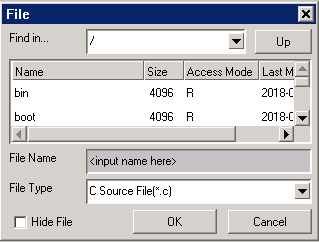
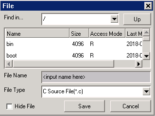
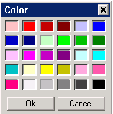

# Using mGUtils

mGUtils is a component of MiniGUI, which provides some common
dialog boxes as window templates for applications, such as opening files,
choosing color values, etc. It also has appropriate customization and
flexibility for user, such as adjusting control layout, changing default
control properties (text color, visible and invisible, background), adding
new control to default dialog box, etc.

## Functions

mGUtils provide the following common dialog boxes:
- Open and save as dialog boxes.
- Color dialog box.
- Font dialog box.
- Info dialog box.

mGUtils have the following appropriate customization and flexibility for
common dialog boxes:

- Change the size of the dialog box.
- Change the layout of the standard controls in the default template, which
     defines the number, type, and position of the standard controls in thedialog box.
- Change the properties/styles of the standard and application custom
     controls.
- Add new controls in the space already available in the dialog box.

Note: Some properties/styles mustn't be changed in default controls, such as
ID, control class name, etc.

mGUtils provide the following common windows (these windows is reserved old
implementation,):

- Virtual console window.
- Status information window.
- Progress information window.
- Tooltip information window.
- Menu List selection window.
- Entries input window.

## Using sample

To meets the need of appropriate customization and flexibility, it needs make
a better separation of the appearance and applied logic for common dialog
boxes. In application's layer, user is only concerned about the appearance of
dialog. In other words, the default controls' applied logic is implemented in
mGUtils library.

So we provide a hook mechanism and DLGTEMPLATE structure for user to meet
customization demand. The type of hook function is the pointer to WNDPROC,
which is a member of common dialog box structure.

For control's appearance in common dialog box, the following properties
mustn't be changed:

- class_name.
- id.

And the following control's properties can be changed:

- position and size.
- caption content.
- text color.
- background information.
- renderer.

When you provide a standard hook function for one of the common dialog boxes,
the default dialog box procedure processes the MSG_INITDIALOG message first,
and then calls the hook function. The lParam parameter, which is a pointer to
the initialization structure specified when the dialog was created in
MSG_INITDIALOG, will be passed to hook function.

Code:

```cpp
extern DLGTEMPLATE DefFileDlg;
extern DLGTEMPLATE DefSimpleFileDlg;

extern LRESULT DefFileDialogProc (HWND hDlg, UINT message, WPARAM wParam, LPARAM lParam);
extern LRESULT DefColorDialogProc (HWND hDlg, UINT message, WPARAM wParam, LPARAM lParam);
extern LRESULT DegFontDialogProc (HWND hDlg, UINT message, WPARAM wParam, LPARAM lParam);
extern LRESULT DefInfoDialogProc (HWND hDlg, UINT message, WPARAM wParam, LPARAM lParam);

```

### Common Dialog Box

```cpp
BOOL ShowCommonDialog (PDLGTEMPLATE dlg_template, HWND hwnd, WNDPROC proc, void* private_data);
```

### Open and Save As Dialog Boxes

The Open dialog box displays a model dialog box that lets the user specify the
directory, and the name of a file to open. The Save As dialog box displays a
model dialog box that lets the user specify the directory, and name of a file
to save.

- FileOpenSaveDialog

```cpp
#define MGU_FOSD_MODEPC 0x00
#define MGU_FOSD_MODESIMPLE 0x01

typedef struct _FILEDLGDATA {
    /** Indicates to create a Save File or an Open File dialog box. */
    BOOL is_save;
    /** The full path name of the file returned. */
    char filefullname[MY_NAMEMAX + MY_PATHMAX + 1];
    /** The name of the file to be opened. */
    char filename[MY_NAMEMAX + 1];
    /** The initial path of the dialog box. */
    char filepath[MY_PATHMAX + 1];
    /** * The filter string, for example: * All file (*.*)|Text file (*.txt;*.TXT)
    */
    char filter[MAX_FILTER_LEN + 1];
    /** The initial index of the filter*/
    int filterindex;
    WNDPROC hook;
} FILEDLGDATA;

/** Data type of pointer to a NEWFILEDLGDATA */*
*typedef FILEDLGDATA* PFILEDLGDATA;
BOOL FileOpenSaveDialog (PDLGTEMPLATE dlg_template, HWND hwnd, WNDPROC proc,
    PFILEDLGDATA pfdd) {
    ...
    return ShowCommonDialog (dlg_template, hwnd, proc, pfdd);
}

LRESULT DefFileDialogProc (HWND hDlg, UINT message, WPARAM wParam, LPARAM lParam) {
...
switch (message){
    case MSG_INITDIALOG:{
        PFILEDLGDATA pfdd = (PFILEDLGDATA)lParam;
        ...
        if (pfdd->hook){
            return pfdd->hook (hDlg, message, wParam, lParam);
        }
            return 1;
        }
        ...
    }
}
```

In mGUtils, at least we need provide two optional file dialog: Open file and
save file Dialog.



##### Figure 1 Open File Dialog



##### Figure 2 Open File Dialog

| *ID* | *class name* | *remarks* |
|------|--------------|-----------|
| IDC_FOSD_PATH_NOTE | CTRL_STATIC | optional |
| IDC_FOSD_PATH | CTRL_COMBOBOX | |
| IDC_FOSD_UPPER | CTRL_BUTTON | optional |
| IDC_FOSD_FILELIST | CTRL_LISTVIEW | |
| IDC_FOSD_FILENAME_NOTE | CTRL_STATIC | |
| IDC_FOSD_FILENAME | CTRL_SLEDIT | |
| IDC_FOSD_FILETYPE_NOTE | CTRL_STATIC | |
| IDC_FOSD_FILETYPE | CTRL_COMBOBOX | |
| IDC_FOSD_ISHIDE | CTRL_BUTTON | optional |
| IDC_FOSD_OK | CTRL_BUTTON | |
| IDC_FOSD_CANCEL | CTRL_BUTTON | |

### Color Dialog Box

The color dialog box displays a modal dialog box that allows the user to
choose a specific color value.

- ColorSelectDialog

```cpp
typedef struct _COLORDLGDATA {
    /** The value of the color returned. */
    gal_pixel pixel;
    /** The R, G, B value of the color returned. */
    Uint8 r, g, b;
    /** The H value of the color returned. */
    Uint16 h;
    /** The S, V value of the color returned. */
    Uint8 s, v;
    WNDPROC hook;
}COLORDLGDATA, *PCOLORDLGDATA;

BOOL ColorSelectDialog (PDLGTEMPLATE dlg_template, HWND hwnd, WNDPROC proc,
PCOLORDLGDATA pcdd)
{
    ... 
    return ShowCommonDialog (dlg_template, hwnd, proc, pcdd);
    ...
}
```

Illustration:


##### Figure 3 Color Select Dialog



##### Figure 4 Small Color Select Dialog

| *ID* | *class name* | *remarks* |
|------|--------------|-----------|
| IDC_CSD_BASIC_COLOR_NOTE | CTRL_STATIC | |
| IDC_CSD_BASIC_COLOR_0 | CTRL_STATIC | |
| IDC_CSD_BASIC_COLOR_1 | CTRL_STATIC | |
| IDC_CSD_BASIC_COLOR_2 | CTRL_STATIC | |
| IDC_CSD_BASIC_COLOR_3 | CTRL_STATIC | |
| IDC_CSD_BASIC_COLOR_4 | CTRL_STATIC | |
| IDC_CSD_BASIC_COLOR_5 | CTRL_STATIC | |
| IDC_CSD_BASIC_COLOR_6 | CTRL_STATIC | |
| IDC_CSD_BASIC_COLOR_7 | CTRL_STATIC | |
| IDC_CSD_BASIC_COLOR_8 | CTRL_STATIC | |
| IDC_CSD_BASIC_COLOR_9 | CTRL_STATIC | |
| IDC_CSD_BASIC_COLOR_10 | CTRL_STATIC | |
| IDC_CSD_BASIC_COLOR_11 | CTRL_STATIC | |
| IDC_CSD_BASIC_COLOR_12 | CTRL_STATIC | |
| IDC_CSD_BASIC_COLOR_13 | CTRL_STATIC | |
| IDC_CSD_BASIC_COLOR_14 | CTRL_STATIC | |
| IDC_CSD_BASIC_COLOR_15 | CTRL_STATIC | |
| IDC_CSD_BASIC_COLOR_16 | CTRL_STATIC | |
| IDC_CSD_BASIC_COLOR_17 | CTRL_STATIC | |
| IDC_CSD_BASIC_COLOR_18 | CTRL_STATIC | |
| IDC_CSD_BASIC_COLOR_19 | CTRL_STATIC | |
| IDC_CSD_BASIC_COLOR_20 | CTRL_STATIC | |
| IDC_CSD_BASIC_COLOR_21 | CTRL_STATIC | |
| IDC_CSD_BASIC_COLOR_22 | CTRL_STATIC | |
| IDC_CSD_BASIC_COLOR_23 | CTRL_STATIC | |
| IDC_CSD_BASIC_COLOR_24 | CTRL_STATIC | |
| IDC_CSD_BASIC_COLOR_25 | CTRL_STATIC | |
| IDC_CSD_BASIC_COLOR_26 | CTRL_STATIC | |
| IDC_CSD_BASIC_COLOR_27 | CTRL_STATIC | |
| IDC_CSD_BASIC_COLOR_28 | CTRL_STATIC | |
| IDC_CSD_BASIC_COLOR_29 | CTRL_STATIC | |
| IDC_CSD_CUSTOM_COLOR_NOTE | CTRL_STATIC | |
| IDC_CSD_CUSTOM_COLOR_0 | CTRL_STATIC | |
| IDC_CSD_CUSTOM_COLOR_1 | CTRL_STATIC | |
| IDC_CSD_CUSTOM_COLOR_2 | CTRL_STATIC | |
| IDC_CSD_CUSTOM_COLOR_3 | CTRL_STATIC | |
| IDC_CSD_CUSTOM_COLOR_4 | CTRL_STATIC | |
| IDC_CSD_CUSTOM_COLOR_5 | CTRL_STATIC | |
| IDC_CSD_SPACE | CTRL_STATIC | |
| IDC_CSD_YSPACE | CTRL_STATIC | |
| IDC_CSD_COLOR | CTRL_STATIC | |
| IDC_CSD_NOTE_Y | CTRL_STATIC | |
| IDC_CSD_NOTE_U | CTRL_STATIC | |
| IDC_CSD_NOTE_V | CTRL_STATIC | |
| IDC_CSD_NOTE_R | CTRL_STATIC | |
| IDC_CSD_NOTE_G | CTRL_STATIC | |
| IDC_CSD_NOTE_B | CTRL_STATIC | |
| IDC_CSD_VALUE_Y | CTRL_SLEDIT | |
| IDC_CSD_VALUE_U | CTRL_SLEDIT | |
| IDC_CSD_VALUE_V | CTRL_SLEDIT | |
| IDC_CSD_VALUE_R | CTRL_SLEDIT | |
| IDC_CSD_VALUE_G | CTRL_SLEDIT | |
| IDC_CSD_VALUE_B | CTRL_SLEDIT | |
| IDC_CSD_ADD | CTRL_BUTTON | |
| IDC_CSD_OK | CTRL_BUTTON | |
| IDC_CSD_CANCEL | CTRL_BUTTON | |

### Font Dialog Box

The Font dialog box displays a model dialog box that lets the user choose
attributes for a logical font, such as family, style (bold, italic, or
regular), point size, effects (underline, strikeout, and text color, etc), and
character set.

- FontSelectDialog

```cpp
typedef struct _FONTDLGDATA {
    /* The font minimize size. */
    int min_size;
    /* The font maximize size. */
    int max_size;
    /* The font color. */
    RGB color;
    PLOGFONT logfont;
    WNDPROC hook;
} FONTDLGDATA, *PFONTDLGDATA;

BOOL FontSelectDialog (PDLGTEMPLATE dlg_template, HWND hwnd, WNDPROC proc,
    PFONTDLGLDATA pfsd) {
    ... ...
    return ShowCommonDialog (dlg_template, hwnd, proc, pfsd);
}
```

- Font style:
     NIL\ALL\BLACK\BOLD\BOOK\DEMIBOLD\LIGHT\MEDIUM\REGULAR\SUBPIXEL
- Font:

Illustration:


##### Figure 5 Small Color Select Dialog

| *ID* | *class name* | *remarks* |
|------|--------------|-----------|
| IDC_FSD_FONT_NOTE | CTRL_STATIC | |
| IDC_FSD_FONT | CTRL_COMBOBOX | |
| IDC_FSD_STYLE_NOTE | CTRL_STATIC | |
| IDC_FSD_STYLE | CTRL_COMBOBOX | |
| IDC_FSDSIZE_NOTE | CTRL_STATIC | |
| IDC_FSD_SIZE | CTRL_COMBOBOX | |
| IDC_FSD_EFFECTS_NOTE | CTRL_STATIC | WS_GROUP |
| IDC_FSD_FLIP_NOTE | CTRL_STATIC | |
| IDC_FSD_FLIP | CTRL_COMBOBOX | |
| IDC_FSD_COLOR_NOTE | CTRL_STATIC | |
| IDC_FSD_COLOR | CTRL_COMBOBOX | |
| IDC_FSD_ITALIC | CTRL_BUTTON | |
| IDC_FSD_STRIKEOUT | CTRL_BUTTON | |
| IDC_FSD_UNDERLINE | CTRL_BUTTON | |
| IDC_FSD_SAMPLE_NOTE | CTRL_STATIC | |
| IDC_FSD_SAMPLE | CTRL_STATIC | |
| IDC_FSD_CHARSET_NOTE | CTRL_STATIC | |
| IDC_FSD_CHARSET | CTRL_COMBOBOX | |
| IDC_FSD_OK | CTRL_BUTTON | |
| IDC_FSD_CANCEL | CTRL_BUTTON | |

### Info Dialog Box

The Info dialog box displays user-defined information.

- InfoShowDialog

```cpp
typedef struct _INFODLGDATA {
const char* msg;
const char* format;
int nr_lines;
int vis_lines;
int start_line;
RECT rc;
WNDPROC hook;
} INFODLGDATA, *PINFODLGDATA;

BOOL InfoShowDialog (PDLGTEMPLATE dlg_template, HWND hwnd, WNDPROC proc,
PINFODLGDATA pidd) {
 ... ...
return ShowCommonDialog (dlg_template, hwnd, proc, pidd);
}
```

Illustration:


##### Figure 6 Small Color Select Dialog

| *ID* | *class name* | *remarks* |
|------|--------------|-----------|
| IDC_IFD_SPIN | CTRL_SPINBOX | |

### Common window dialog

These common window dialog box displays user-defined information.

- myMessgeBox: Creates a message box.

creates a message box calling  MessageBox and passing hwnd, it also receives
printf-like arguments to format a string. return Identifier of the button which closes the message box.


```cpp
MGUTILS_EXPORT int myMessageBox (HWND hwnd, DWORD dwStyle, const char* title,
                const char* text, ...);
```


##### Figure 7 Small Color Select Dialog

- ProgressBar: Creates a main window within a progress bar.

creates a main window within a progress bar and returns the
handle.  Note that you can use SendDlgItemMessage to send a message to the 
progress bar in the main window in order to update the progress bar.

```cpp
MGUTILS_EXPORT HWND createProgressWin (HWND hParentWnd, const char* title,
                const char* label, int id, int range);
```


##### Figure 8 Progress Box

- Other common dialog:
   - createStatusWin: creates a status main window
   - errorWindow: creates a message box by using myMessageBox, and display
     the current system error message
   - myWinTernary: creates a message box hosted to the main window, displays a
     message and an application icon in the message box, and creates two
     buttons in it
   - myWinMessage: creates a message box within only one button 
   - myWinMenu:creates a menu main window including a few buttons, and a list
     box with checkable item. 
   - myWinEntries: Creates a entry main window for the user to enter something

```cpp
MGUTILS_EXPORT HWND createStatusWin (HWND hParentWnd, int width, int height,
                const char* title, const char* text, ...);

MGUTILS_EXPORT void errorWindow (HWND hwnd, const char* str, const char* title);

MGUTILS_EXPORT int myWinTernary (HWND hwnd, const char* title,
                const char* button1, const char* button2, const char* button3,
                const char* text, ...);

MGUTILS_EXPORT int myWinChoice (HWND hwnd, const char* title,
                const char* button1, const char* button2,
                const char* text, ...);

MGUTILS_EXPORT int myWinMessage (HWND hwnd, const char* title,
                const char* button1, const char* text, ...);

MGUTILS_EXPORT int myWinMenu (HWND hParentWnd, const char* title,
                const char* label, int width, int listboxheight,
                char ** items, int * listItem, myWINBUTTON* buttons);

MGUTILS_EXPORT int myWinEntries (HWND hParentWnd, const char* title,
                const char* label, int width, int editboxwidth,
                BOOL fIME, myWINENTRY* items, myWINBUTTON* buttons);
```

- Using Sample

How to using message box and progress bar, you should enable
`--enable-ctrlpgbar` first before you use an progress bar dialog.

```cpp
static void my_notif_proc (HWND hwnd, LINT id, int nc, DWORD add_data)
{
    if (nc == BN_CLICKED) {
        switch (id) {
            case IDC_MMB:
                myMessageBox(GetParent (hwnd) , MB_OK , "myMessageBox:" , "NOTE: \n %s \n" , prompts [id - IDC_MMB]);
                break;
            case IDC_PROMPT:
                PostMessage(GetParent (hwnd) , MSG_PROGRESS , IDC_PROGRESS , 0);
                break;
        }
    }
}

static LRESULT DialogBoxProc2 (HWND hDlg, UINT message, WPARAM wParam, LPARAM lParam)
{
...
    int ppos = 5;
    switch (message) {
        case MSG_PROGRESS:
#ifdef _MGCTRL_PROGRESSBAR
            if (!prohwnd) {
                prohwnd = createProgressWin(hDlg , "Progress" , "setup...." , IDC_PROGRESS , 100);
                SetTimer(hDlg , 100  , 100); 
                SendDlgItemMessage(prohwnd , IDC_PROGRESS , PBM_SETSTEP , 10 , 0);
            }
#endif
            break;
        case MSG_TIMER:
        {
#ifdef _MGCTRL_PROGRESSBAR
                if (wParam == 100 && prohwnd){
                    if (ppos < 10) {
                        SendDlgItemMessage(prohwnd , IDC_PROGRESS , PBM_SETPOS, 10*ppos , 0);
                        ppos++;
                    }
                    else {
                        KillTimer(hDlg , 100);
                        destroyProgressWin(prohwnd);
                        prohwnd = 0;
                        ppos = 0;
                    }
                }
#endif
        }
}
```

## Message

### MSG_FILESELOK

An Open or Save As dialog box sends the MSG_FILESELOK message to the hook
procedure, when the user specifies a file name and clicks the OK button. The
hook procedure can accept the file name and allow the dialog box to close, or
reject the file name and force the dialog box to remain open.

Parameters:

- wParam: not used.
- lParam: The pointer to an FILEDLGDATA structure. The filefullname member
     of this structure contains the path, and file name specified by the user.

Return value:

- If the hook procedure returns zero, the Open or Save As dialog box
     accepts the specified file name and closes.
- If the hook procedure returns a nonzero value, the Open or Save As dialog
     box rejects the specified file name and remains open.

### MSG_COLORSELOK

An Color dialog box sends the MSG_COLORSELOK message to the hook procedure,
when the user selects a color and clicks the OK button. The hook procedure can
accept the color and allow the dialog box to close, or reject the color and
force the dialog box to remain open.

Parameters:

- wParam: not used.
- lParam: The pointer to an COLORDLGDATA structure. The r, g, b member of
     this structure contain the RGB color value of the selected color.

Return value:

- If the hook procedure returns zero, the Color dialog box accepts the
     selected color and closes.
- If the hook procedure returns a nonzero value, the Color dialog box
     rejects the selected color and remains open.

### MSG_FONTSELOK

An Font dialog box sends the MSG_FONTSELOK message to the hook procedure, when
the user specifies a logical font and clicks the OK button. The hook procedure
can accept logical font and allow the dialog box to close, or reject the
logical font and force the dialog box to remain open.

Parameters:

- wParam: not used.
- lParam: The pointer to an FONTDLGDATA structure. The logfont member of
  this structure contains the logical font specified by the user.

Return value:

- If the hook procedure returns zero, the Font dialog box accepts the
     specified logical font and closes.
- If the hook procedure returns a nonzero value, the Font dialog box
     rejects the specified logical font and remains open.

----

[&lt;&lt; Other Programming Topic](MiniGUIProgGuidePart1Chapter11.md) |
[Table of Contents](README.md) |
[Brief Introduction to mGNCS &gt;&gt;](MiniGUIProgGuidePart2Chapter01.md)

[Release Notes for MiniGUI 3.2]: /supplementary-docs/Release-Notes-for-MiniGUI-3.2.md
[Release Notes for MiniGUI 4.0]: /supplementary-docs/Release-Notes-for-MiniGUI-4.0.md
[Showing Text in Complex or Mixed Scripts]: /supplementary-docs/Showing-Text-in-Complex-or-Mixed-Scripts.md
[Supporting and Using Extra Input Messages]: /supplementary-docs/Supporting-and-Using-Extra-Input-Messages.md
[Using CommLCD NEWGAL Engine and Comm IAL Engine]: /supplementary-docs/Using-CommLCD-NEWGAL-Engine-and-Comm-IAL-Engine.md
[Using Enhanced Font Interfaces]: /supplementary-docs/Using-Enhanced-Font-Interfaces.md
[Using Images and Fonts on System without File System]: /supplementary-docs/Using-Images-and-Fonts-on-System-without-File-System.md
[Using SyncUpdateDC to Reduce Screen Flicker]: /supplementary-docs/Using-SyncUpdateDC-to-Reduce-Screen-Flicker.md
[Writing DRI Engine Driver for Your GPU]: /supplementary-docs/Writing-DRI-Engine-Driver-for-Your-GPU.md
[Writing MiniGUI Apps for 64-bit Platforms]: /supplementary-docs/Writing-MiniGUI-Apps-for-64-bit-Platforms.md

[Quick Start]: /user-manual/MiniGUIUserManualQuickStart.md
[Building MiniGUI]: /user-manual/MiniGUIUserManualBuildingMiniGUI.md
[Compile-time Configuration]: /user-manual/MiniGUIUserManualCompiletimeConfiguration.md
[Runtime Configuration]: /user-manual/MiniGUIUserManualRuntimeConfiguration.md
[Tools]: /user-manual/MiniGUIUserManualTools.md
[Feature List]: /user-manual/MiniGUIUserManualFeatureList.md

[MiniGUI Overview]: /MiniGUI-Overview.md
[MiniGUI User Manual]: /user-manual/README.md
[MiniGUI Programming Guide]: /programming-guide/README.md
[MiniGUI Porting Guide]: /porting-guide/README.md
[MiniGUI Supplementary Documents]: /supplementary-docs/README.md
[MiniGUI API Reference Manuals]: /api-reference/README.md

[MiniGUI Official Website]: http://www.minigui.com
[Beijing FMSoft Technologies Co., Ltd.]: https://www.fmsoft.cn
[FMSoft Technologies]: https://www.fmsoft.cn
[HarfBuzz]: https://www.freedesktop.org/wiki/Software/HarfBuzz/
