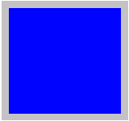
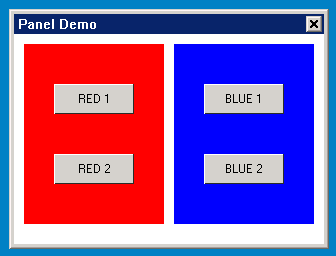

# Panel and Its Derived Class

## Brief Introduction of Panel Class Control

This class of control is the container class controls that accommodate other
classes of controls, which are generally combination control class and main
window class.

The class inheritance relation of panel and its derived class is as follows:

- [mWidget](MStudioMGNCSV1dot0PGENP2C3#mWidget)
- [mPanel](MiniGUIProgGuidePart2Chapter07#mPanel.md)
* [mComboBox](MiniGUIProgGuidePart2Chapter07#mComboBox.md)
* [mMainWnd](MiniGUIProgGuidePart2Chapter07#mMainWnd.md)
* [mDialogBox](MiniGUIProgGuidePart2Chapter07#mDialogBox.md)

## `mPanel`

- *Control name*: `NCSCTRL_PANEL`
- *English name*: Panel
- *Brief introduction*: Container of other controls, mainly used for carrying
out grouped operation to the controls. Through grouping the controls into the
panel control, a group of controls can be conveniently displayed or hidden.
- *Schematic diagram*: <br/>



Panel must exist in `MainWnd`, `DialogBox`, another Panel control or other
controls. Besides other controls, it can contain content such as texts and
images etc.

### Style of `mPanel`

It is inherited from the style of [mWidget](MStudioMGNCSV1dot0PGENP2C3#mWidget).

### Property of `mPanel`

It is inherited from the property of [mWidget](MStudioMGNCSV1dot0PGENP2C3#mWidget).

### Event of `mPanel`

It is inherited from the event of [mWidget](MStudioMGNCSV1dot0PGENP2C3#mWidget).

### Method of `mPanel`

It is inherited from the method of [mWidget](MStudioMGNCSV1dot0PGENP2C3#mWidget).

The class does not have newly added methods

### Renderer of `mPanel`

It is inherited from the renderer of [mWidget](MStudioMGNCSV1dot0PGENP2C3#mWidget). 

`mPanel` does not have newly added renderer method

### Example of `mPanel`

This example demonstrates how to use panel to group multiple controls to the
users.



Figure p2c6-1 Output of panel Program

##### List 1 panel.c
##### List 1 panel.c
<p align=center>List p2c6-1 panel.c</p>
```cpp
%INCLUDE{"%ATTACHURL%/panel.c.txt"}%
```
## `mCombobox`

- *Control name*: `NCSCTRL_COMBOBOX`
- *English name*: Combobox
- *Brief introduction*: An edit box and a list box are integrated. Users can
directly key text in the edit box and can select an existing item from the
options listed in the list box. Input and selection functions of users can be
well completed. Address column in general browser is a good application.


### Style of `mCombobox`

It is inherited from the style of [mPanel](MiniGUIProgGuidePart2Chapter07#mPanel.md).

| *Style name* | *miniStudio property name* | *Explanation* |
| `NCSS_CMBOX_SIMPLE` | Type->Simple | Simple combination box |
| `NCSS_CMBOX_DROPDOWNLIST` | Type->DropDownList | Dropdown combination box |
| `NCSS_CMBOX_SORT` | Sort->TRUE | Character string automatic sorting |
| `NCSS_CMBOX_EDITNOBORDER` | `EditHasBorder->FALSE` | The edit box does not have border |
| `NCSS_CMBOX_EDITBASELINE` | `EditHasBaseLine->TRUE` | The edit box displays underlined characters |
| `NCSS_CMBOX_READONLY` | `ReadOnly` | Content displayed by the edit box is read only |
| `NCSS_CMBOX_UPPERCASE` | Case->Upper | All the display content of the edit box is converted to capital letter display |
| `NCSS_CMBOX_LOWERCASE` | Case->Lower | All the display content of the edit box is converted to lowercase letter display |
| `NCSS_CMBOX_AUTOFOCUS` | `AutoFocus->TRUE` | The control gets focus and automatically transfers to the edit box |

### Property of `mCombobox`

It is inherited from the property of
[mPanel](MiniGUIProgGuidePart2Chapter07#mPanel.md). 

| *Property name* | *miniStudio property name* | *Type* | *RW* | *Explanation* |
| `NCSP_COMB_DROPDOWNHEIGHT` | `DropDownHeight` | int | `RW` | Height of the dropdown list |
| `NCSP_COMB_ITEMHEIGHT` | `ItemHeight` | int | `RW` | Height of the list item |
| `NCSP_COMB_ITEMCOUNT` | `ItemCount` | int | `RO` | Number of the list items |
| `NCSP_COMB_TEXTLIMIT`| `TextLimit` | int | `RW` | Limit of the edit box |
| `NCSP_COMB_SELECT` | -- | int | `RW` | Selection items index |

### Event of `mCombobox`

It is inherited from the event of
[mPanel](MiniGUIProgGuidePart2Chapter07#mPanel.md). 

| *Event ID | *Parameter* | *Explanation* |
| `NCSN_CMBOX_SELCHANGE` | -- | The selected item changes |
| `NCSN_CMBOX_SETFOCUS` | -- | Get focus |
| `NCSN_CMBOX_KILLFOCUS` | -- | Lose focus |
| `NCSN_CMBOX_EDITCHANGE` | -- | Content of the edit box changes |
| `NCSN_CMBOX_DROPDOWN` | -- | Dropdown list pops up |
| `NCSN_CMBOX_CLOSEUP` | -- | Dropdown list is closed |
| `NCSN_CMBOX_SELECTOK` | -- | Select an item when the dropdown list is closed |
| `NCSN_CMBOX_SELECTCANCEL` | -- | No selection when the dropdown list is closed |

### Method of `mCombobox`

It is inherited from the method of
[mPanel](MiniGUIProgGuidePart2Chapter07#mPanel.md). 

#### `addItem`

```cpp
BOOL addItem(mCombobox *self, const char *item, DWORD addData);
```
- Parameter:<BR>
- item – add the content of selected item
- `addData` – additional data of the item
- Explanation:<BR>
Add selected items to the dropdown list of combobox
- Example:<BR>

```cpp
char *items = {
    "first item --- Chinese",
    "second item --- German",
    "third item -- English"
};
//Add three items to the dropdown list
for (i = 0; i < 3; i++)
{
    _c(combo)->addItem(combo, items[i]， 0);
}
```

#### `removeItem`

```cpp
 BOOL removeItem(mCombobox *self, int index);
```
- Parameter:<BR>
- index – index of the items to be deleted
- Explanation:<BR>
Delete certain selected item from the dropdown list of combobox
- Example:<BR>

```cpp
//Delete the first item of the dropdown list
_c(combo)->removeItem(combo, 0);
```

#### `setItem`

```cpp
BOOL setItem(mCombobox *self, int index, const char *item); 
```
- Parameter:<BR>
- index – index of the items to be modified
- Explanation:<BR>
Modify content of certain selected item in the dropdown list of combobox
- Example:<BR>

```cpp
//Modify the content of the first item in the dropdown list to "new content"
_c(combo)->setItem(combo, 0, "new content");
```

#### `getItem`

```cpp
const char* getItem(mCombobox *self, int index); 
```
- Parameter:<BR>
- index – index of the items to get
- Explanation:<BR>
Get content of certain selected item in the dropdown list of combobox
- Example:<BR>

```cpp
const char *item_1 = _c(combo)->getItem(combo, 0);
```

#### `setAddData`
```cpp
void* setAddData(mCombobox *self, int index, DWORD addData); 
```
- Parameter:<BR>
- index – index of the items to set additional data
- `addData` – information of additional data
- Explanation:<BR>
Set additional data of certain selected item in the dropdown list of combobox
- Example:<BR>

```cpp
PBITMAP pbmp;
LoadBitmap (......);
_c(combo)->setAddData(combo, 0, (DWORD)pbmp);
```

#### `getAddData`
```cpp
DWORD getAddData(mCombobox *self, int index); 
```
- Parameter:<BR>
- index – index of the items to get additional data
- Explanation:<BR>
Get additional data of certain selected item in the dropdown list of combobox
- Example:<BR>

```cpp
DWORD add = _c(combo)->getAddData(combo, 0);
```

### Renderers of `mCombobox`

They are inherited from the renderers of
[mPanel](MiniGUIProgGuidePart2Chapter07#mPanel.md). 

#### `mCombobox` Classic Renderer

| *Property name* | *miniStudio property name* | *Type* | *Schematic diagram* | *Explanation* |
| `NCS_BGC_3DBODY` | `ColorBg3DBody` | `DWORD(ARGB`) | | Draw color of the dropdown button |
| `NCS_FGC_WINDOW` | `ColorFgWindow` | `DWORD(ARGB`) | | Draw color of the arrow of the dropdown button |

#### `mCombobox` Fashion Renderer

| *Property name* | *miniStudio property name* | *Type* | *Schematic diagram* | *Explanation* |
| `NCS_BGC_3DBODY` | `ColorBg3DBody` | `DWORD(ARGB`) | | Draw color of the dropdown button |
| `NCS_FGC_WINDOW` | `ColorFgWindow` | `DWORD(ARGB`) | | Draw color of the arrow of the dropdown button |
| `NCS_METRICS_3DBODY_ROUNDX` | `RoundX` | int | | Round corner x radius of the dropdown button |
| `NCS_METRICS_3DBODY_ROUNDY` | `RoundY` | int | | Round corner y radius of the dropdown button |
| `NCS_MODE_BGC` | `GradientMode` | int | | Drawing mode of the gradual change effect (horizontal gradual change or vertical gradual change) |

#### `mCombobox` Skin Renderer

Refer to [Appendix B](MStudioMGNCSV1dot0PGENAppB][Image Specification]] in the
Specification for the Image Resource Used by Skin Renderer
([[MStudioMGNCSV1dot0PGENAppB)). 

#### `mCombobox` Flat Renderer

| *Property name* | *miniStudio property name* | *Type* | *Schematic diagram* | *Explanation* |
| `NCS_BGC_3DBODY` | `ColorBg3DBody` | `DWORD(ARGB`) | | Draw color of the dropdown button |
| `NCS_FGC_WINDOW` | `ColorFgWindow` | `DWORD(ARGB`) | | Draw color of the arrow of the dropdown button |

### Example of `mCombobox`


##### List 1 combobox.c
##### List 1 combobox.c
<p align=center>List p2c6-1 combobox.c</p>
```cpp
%INCLUDE{"%ATTACHURL%/combobox"}%
```


[Next](MStudioMGNCSV1dot0PGENP2C5][Previous]] < [[MStudioMGNCSV1dot0PGEN][Index]] > [[MStudioMGNCSV1dot0PGENP2C7)


-- Main.XiaodongLi - 28 Feb 2010


----

[&lt;&lt; ](MiniGUIProgGuidePart.md) |
[Table of Contents](README.md) |
[ &gt;&gt;](MiniGUIProgGuidePart.md)

[Release Notes for MiniGUI 3.2]: /supplementary-docs/Release-Notes-for-MiniGUI-3.2.md
[Release Notes for MiniGUI 4.0]: /supplementary-docs/Release-Notes-for-MiniGUI-4.0.md
[Showing Text in Complex or Mixed Scripts]: /supplementary-docs/Showing-Text-in-Complex-or-Mixed-Scripts.md
[Supporting and Using Extra Input Messages]: /supplementary-docs/Supporting-and-Using-Extra-Input-Messages.md
[Using CommLCD NEWGAL Engine and Comm IAL Engine]: /supplementary-docs/Using-CommLCD-NEWGAL-Engine-and-Comm-IAL-Engine.md
[Using Enhanced Font Interfaces]: /supplementary-docs/Using-Enhanced-Font-Interfaces.md
[Using Images and Fonts on System without File System]: /supplementary-docs/Using-Images-and-Fonts-on-System-without-File-System.md
[Using SyncUpdateDC to Reduce Screen Flicker]: /supplementary-docs/Using-SyncUpdateDC-to-Reduce-Screen-Flicker.md
[Writing DRI Engine Driver for Your GPU]: /supplementary-docs/Writing-DRI-Engine-Driver-for-Your-GPU.md
[Writing MiniGUI Apps for 64-bit Platforms]: /supplementary-docs/Writing-MiniGUI-Apps-for-64-bit-Platforms.md

[Quick Start]: /user-manual/MiniGUIUserManualQuickStart.md
[Building MiniGUI]: /user-manual/MiniGUIUserManualBuildingMiniGUI.md
[Compile-time Configuration]: /user-manual/MiniGUIUserManualCompiletimeConfiguration.md
[Runtime Configuration]: /user-manual/MiniGUIUserManualRuntimeConfiguration.md
[Tools]: /user-manual/MiniGUIUserManualTools.md
[Feature List]: /user-manual/MiniGUIUserManualFeatureList.md

[MiniGUI Overview]: /MiniGUI-Overview.md
[MiniGUI User Manual]: /user-manual/README.md
[MiniGUI Programming Guide]: /programming-guide/README.md
[MiniGUI Porting Guide]: /porting-guide/README.md
[MiniGUI Supplementary Documents]: /supplementary-docs/README.md
[MiniGUI API Reference Manuals]: /api-reference/README.md

[MiniGUI Official Website]: http://www.minigui.com
[Beijing FMSoft Technologies Co., Ltd.]: https://www.fmsoft.cn
[FMSoft Technologies]: https://www.fmsoft.cn
[HarfBuzz]: https://www.freedesktop.org/wiki/Software/HarfBuzz/
