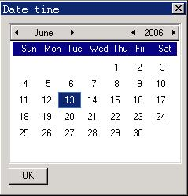

# Month Calendar Control

The month calendar control provides a user interface similar to a calendar, and
makes the user be able to select and set the date conveniently. The application
can get or set the date by sending message to a month calendar control.

You can create a month calendar control by calling `CreateWindow` function with
`CTRL_MONTHCALENDAR` as the control class name.

## Styles of Month Calendar

A month calendar control can use several forms of Chinese or English and so on
to display the date information such as week, month, etc. Specifying the 
control style to be `MCS_CHN`, `MCS_ENG_L`, or `MCS_ENG_S` can complete this. 
If a month calendar control has the style `MCS_CHN`, the control will display
the date information in Chinese; if having the style `MCS_ENG_L`, the control
will display the date information in English; and if having the style 
`MCS_ENG_S`, the control displays the date information in abbreviate English.

If having the style `MCS_NOTIFY`, the month calendar control will generate
corresponding notification messages in cases such as responding to the user’s
operation. 

## Messages of Month Calendar
### Getting Date

`MCM_GETCURDAY` message is used to get the day of the month of the current
selected date:

```
```

The return value of `SendMessage` is the current day of the month, in the range
1 to 31.

`MCM_GETCURMONTH` message is used to get the number of months of the current
selected date:

```
```

The return value of `SendMessage` is the number of months since January, in the
range 0 to 11.

`MCM_GETCURYEAR` message is used to get the number of years of the current
selected date:

```
```
```
```
```
```

The return value of `SendMessage` is the length of the current month.

`MCM_GETFIRSTWEEKDAY` message is used to determine which weekday is the first
day in the current month:

```
```

The return value of `SendMessage` is the weekday number of the first day in the
current month. The weekday number is the number of days since Sunday, in the
range 0 to 6.

`MCM_GETCURDATE` message gets the current selected date in a month calendar
control: 

```
```

Here systime is a structure of `SYSTEMTIME` type, which stores the gotten date
information such as year, month, day, and week, etc. This structure is also 
used for messages such as `MCM_GETTODAY` and so on. The definition of 
`SYSTEMTIME` structure is as follows:

```
```

`MCM_GETTODAY` message gets the date of "today".

```
```

Here systime is also a structure of `SYSTEMTIME` type.

### Setting Date

It should be noted that special user right (such as root) may needed to set the
date in Linux/UNIX system.

`MCM_SETCURDAY` message sets the current day, `MCM_SETCURMONTH` message sets 
the current month, and `MCM_SETCURYEAR` sets the current year:

```
```

Here, day, month, and year specify the new day, month and year respectively, 
and if these values exceed the rational values, the control will adopt the most
approached day, month, or year.

`MCM_SETCURDATE` message sets a specified date as the current selected data:

```
```

`MCM_SETTODAY` sets today as the current selected date:

```
```

### Adjusting Colors

An application can set or get the color of each element in a month calendar
control by `MCM_GETCOLOR` and `MCM_SETCOLOR` messages:

```
```

Here color is a structure of `MCCOLORINFO,` and is used to store color
information: 

```
```

### Size of Control

A month calendar has a minimum limit for the window to display content in it
normally. `MCM_GETMINREQRECTW` and `MCM_GETMINREQRECTH` messages are used to 
get the minimum width and the minimum height respectively:

```
```

The return values of `SendMessage` functions are the minimum width and height.

## Notification Codes of Month Calendar

When user clicked month calendar and the currently selected date is changed, 
the control will generate `MCN_DATECHANGE` notification code.

## Sample Program

Program in List 1 illustrates the use of month calendar control. Please refer 
to monthcal.c file of the demo program package of this guide for the complete
source code.


List 1 Sample Program of month calendar control

```
```




Figure 1 Use of month calendar


-- Main.XiaodongLi - 26 Oct 2009


----

[&lt;&lt; ](MiniGUIProgGuidePart.md) |
[Table of Contents](README.md) |
[ &gt;&gt;](MiniGUIProgGuidePart.md)

[Release Notes for MiniGUI 3.2]: /supplementary-docs/Release-Notes-for-MiniGUI-3.2.md
[Release Notes for MiniGUI 4.0]: /supplementary-docs/Release-Notes-for-MiniGUI-4.0.md
[Showing Text in Complex or Mixed Scripts]: /supplementary-docs/Showing-Text-in-Complex-or-Mixed-Scripts.md
[Supporting and Using Extra Input Messages]: /supplementary-docs/Supporting-and-Using-Extra-Input-Messages.md
[Using CommLCD NEWGAL Engine and Comm IAL Engine]: /supplementary-docs/Using-CommLCD-NEWGAL-Engine-and-Comm-IAL-Engine.md
[Using Enhanced Font Interfaces]: /supplementary-docs/Using-Enhanced-Font-Interfaces.md
[Using Images and Fonts on System without File System]: /supplementary-docs/Using-Images-and-Fonts-on-System-without-File-System.md
[Using SyncUpdateDC to Reduce Screen Flicker]: /supplementary-docs/Using-SyncUpdateDC-to-Reduce-Screen-Flicker.md
[Writing DRI Engine Driver for Your GPU]: /supplementary-docs/Writing-DRI-Engine-Driver-for-Your-GPU.md
[Writing MiniGUI Apps for 64-bit Platforms]: /supplementary-docs/Writing-MiniGUI-Apps-for-64-bit-Platforms.md

[Quick Start]: /user-manual/MiniGUIUserManualQuickStart.md
[Building MiniGUI]: /user-manual/MiniGUIUserManualBuildingMiniGUI.md
[Compile-time Configuration]: /user-manual/MiniGUIUserManualCompiletimeConfiguration.md
[Runtime Configuration]: /user-manual/MiniGUIUserManualRuntimeConfiguration.md
[Tools]: /user-manual/MiniGUIUserManualTools.md
[Feature List]: /user-manual/MiniGUIUserManualFeatureList.md

[MiniGUI Overview]: /MiniGUI-Overview.md
[MiniGUI User Manual]: /user-manual/README.md
[MiniGUI Programming Guide]: /programming-guide/README.md
[MiniGUI Porting Guide]: /porting-guide/README.md
[MiniGUI Supplementary Documents]: /supplementary-docs/README.md
[MiniGUI API Reference Manuals]: /api-reference/README.md

[MiniGUI Official Website]: http://www.minigui.com
[Beijing FMSoft Technologies Co., Ltd.]: https://www.fmsoft.cn
[FMSoft Technologies]: https://www.fmsoft.cn
[HarfBuzz]: https://www.freedesktop.org/wiki/Software/HarfBuzz/
