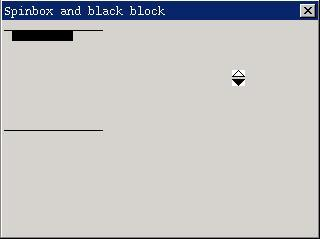

# Spin Box Control

The spin box control described in this chapter makes the user be able to select
from a group of predefined values. The interface of a spin box control contains
up and down arrows, and the user can select a value by clicking the arrows.

You can create a spin box control by calling `CreateWindow` function with
`CTRL_SPINBOX` as the control class name.

It should be noted that the size of a spin box control is fixed, that is to 
say, the width and height of the window passed through `CreateWindow` function
will be ignored.

## Styles of Spin Box

Generally, a spin box control has one style `SPS_AUTOSCROLL`. Spin boxes with
this style can automatically determine the present scrolling state of the spin
box, and disable (gray) the up and down arrows when it reaches the maximum or
the minimum value. The scrolling states of the spin box without this style
should be mastered by the application.

## Messages of Spin Box
### Setting/Getting Position

Generally, after a spin box has been created, we can set the attributes and
states of the control by sending `SPM_SETINFO` message to it. Certainly, we can
also use this message to reset the attributes of the control:

```
```

In above codes, spinfo is a structure of `SPININFO` type, and its definition is
as following:

```
```

The fields of `SPININFO` structure specify the maximum position value, the
minimum position value, and the current position value of a spin box control.
For the spin box control with `SPS_AUTOSCROLL`, the following condition must be
satisfied: maximum position value >= current position value >= minimum position
value. 

`SPM_GETINFO` message is used to get the attributes of a spin box control:

```
```

Here spinfo is used to store the gotten attribute values.

`SPM_SETCUR` message is used to set the current position of a spin box control:

```
```

Here cur is the desired current position of a spin box to be set, and cur 
should be in the range of the minimum and the maximum when its style is
`SPS_AUTOSCROLL`, otherwise the set will fail, and `SendMessage` returns -1.

`SPM_GETCUR` message is used to get the current position:

```
```

### Disabling and Enabling

`SPM_DISABLEDOWN`, `SPM_ENABLEDOWN`, `SPM_DISABLEUP` and `SPM_ENABLEUP` are 
used to disable and enable the scrolling ability of the up/down arrow
respectively but never mind the current position reached the maximum or 
minimum. These messages only work for spin boxes without `SPS_AUTOSCROLL` 
style. For spin boxes with `SPS_AUTOSCROLL` style, the scrolling ability and
states of the arrows are controlled by the control itself:

```
```

### Target Window

`SPM_SETTARGET` message sets the target window of a spin box:

```
```

When the user clicks the up/down arrow of the spin box, the spin box will send
`MSG_KEYDOWN` and `MSG_KEYUP` message to the target window. `wParam` parameter
is `SCANCODE_CURSORBLOCKUP` (when clicking the up arrow) or
`SCANCODE_CURSORBLOCKDOWN` (when clicking the down arrow), and `lParam`
parameter will have the flag of `KS_SPINPOST` to indicate that the message 
comes from a spin box.

`SPM_GETTARGET` message gets the target window of a spin box:

```
```

## Notification Codes of Spin Box

A spin box will generate a `SPN_REACHMAX` notification code when it greater 
than or equal to the maximum. It will generate a `SPN_REACHMIN` notification
code when it less than or equal to the minimum.

## Sample Program

The program in List 1 illustrates the use of a spin box control. Please refer 
to spinbox.c file of the demo program package of this guide for the complete
source code.


List 1 Example of spin box

```
```




Figure 1 The use of spin box control


The spinbox.c program creates a spin box control with `SPS_AUTOSCROLL` in a
dialog box, and the user can operate the black block to move between the top 
and bottom lines by clicking the up and down arrows of the spin box.

-- Main.XiaodongLi - 26 Oct 2009


----

[&lt;&lt; ](MiniGUIProgGuidePart.md) |
[Table of Contents](README.md) |
[ &gt;&gt;](MiniGUIProgGuidePart.md)

[Release Notes for MiniGUI 3.2]: /supplementary-docs/Release-Notes-for-MiniGUI-3.2.md
[Release Notes for MiniGUI 4.0]: /supplementary-docs/Release-Notes-for-MiniGUI-4.0.md
[Showing Text in Complex or Mixed Scripts]: /supplementary-docs/Showing-Text-in-Complex-or-Mixed-Scripts.md
[Supporting and Using Extra Input Messages]: /supplementary-docs/Supporting-and-Using-Extra-Input-Messages.md
[Using CommLCD NEWGAL Engine and Comm IAL Engine]: /supplementary-docs/Using-CommLCD-NEWGAL-Engine-and-Comm-IAL-Engine.md
[Using Enhanced Font Interfaces]: /supplementary-docs/Using-Enhanced-Font-Interfaces.md
[Using Images and Fonts on System without File System]: /supplementary-docs/Using-Images-and-Fonts-on-System-without-File-System.md
[Using SyncUpdateDC to Reduce Screen Flicker]: /supplementary-docs/Using-SyncUpdateDC-to-Reduce-Screen-Flicker.md
[Writing DRI Engine Driver for Your GPU]: /supplementary-docs/Writing-DRI-Engine-Driver-for-Your-GPU.md
[Writing MiniGUI Apps for 64-bit Platforms]: /supplementary-docs/Writing-MiniGUI-Apps-for-64-bit-Platforms.md

[Quick Start]: /user-manual/MiniGUIUserManualQuickStart.md
[Building MiniGUI]: /user-manual/MiniGUIUserManualBuildingMiniGUI.md
[Compile-time Configuration]: /user-manual/MiniGUIUserManualCompiletimeConfiguration.md
[Runtime Configuration]: /user-manual/MiniGUIUserManualRuntimeConfiguration.md
[Tools]: /user-manual/MiniGUIUserManualTools.md
[Feature List]: /user-manual/MiniGUIUserManualFeatureList.md

[MiniGUI Overview]: /MiniGUI-Overview.md
[MiniGUI User Manual]: /user-manual/README.md
[MiniGUI Programming Guide]: /programming-guide/README.md
[MiniGUI Porting Guide]: /porting-guide/README.md
[MiniGUI Supplementary Documents]: /supplementary-docs/README.md
[MiniGUI API Reference Manuals]: /api-reference/README.md

[MiniGUI Official Website]: http://www.minigui.com
[Beijing FMSoft Technologies Co., Ltd.]: https://www.fmsoft.cn
[FMSoft Technologies]: https://www.fmsoft.cn
[HarfBuzz]: https://www.freedesktop.org/wiki/Software/HarfBuzz/
